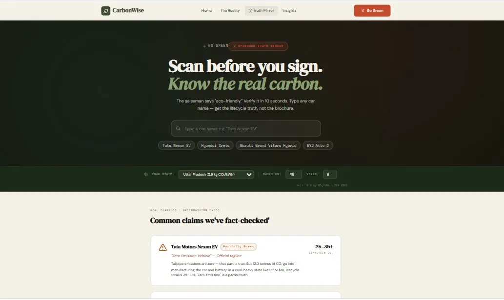
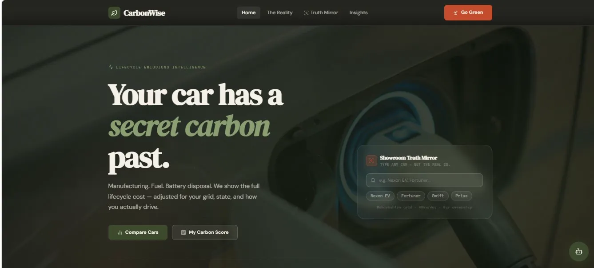
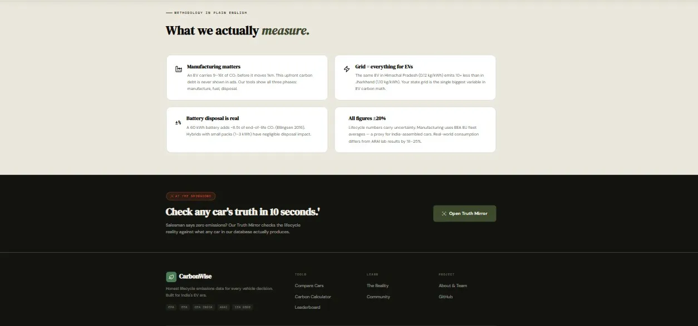
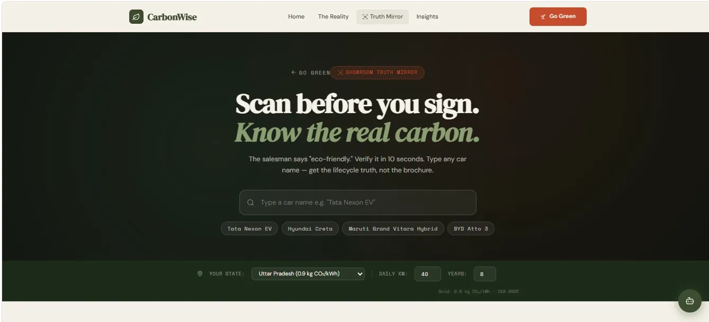
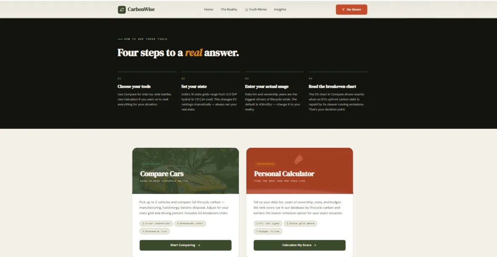
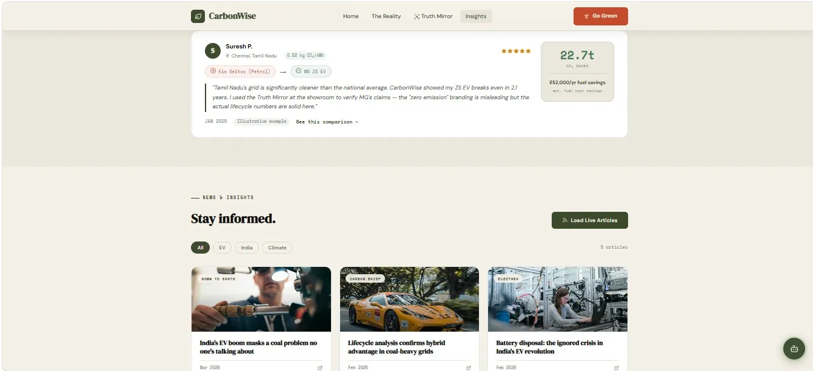

# CarbonWise — Lifecycle Vehicle Emissions Intelligence

> **The "Google Flights for sustainable cars" — full lifecycle CO₂ comparison, greenwash detection, and AI-powered carbon advice, built on EPA + EEA data.**

[](https://react.dev)
[](https://vitejs.dev)
[](https://djangoproject.com)
[](https://www.eea.europa.eu)
[](https://console.groq.com)
[](LICENSE)
[](https://carbonwise.vercel.app)

---

## Live Demo

> **[carbonwise-brown.vercel.app](carbonwise-brown.vercel.app)**



---

## What It Does

CarbonWise is a full-stack vehicle emissions intelligence platform that lets car buyers, researchers, and curious users cut through automaker greenwashing and see the **true lifecycle carbon cost** of any vehicle — without writing a single line of code.

It accounts for manufacturing emissions, real-world fuel/energy use, battery disposal, and your state's grid intensity — giving you an honest, science-backed picture instead of tailpipe-only marketing numbers.

---

### Compare Cars

Head-to-head lifecycle battle for up to 3 vehicles simultaneously. Adjust for your state's grid intensity and driving pattern. Includes a D3-powered breakeven chart showing exactly when (or whether) an EV pays off its manufacturing carbon debt vs. a petrol alternative.

### Truth Mirror (Greenwash Detector)

Search any car — get an instant verdict: **Genuinely Green**, **Partially Green**, or **Greenwashing**. Backed by a curated database of real claims from EEA 2022, NDTV Auto, and AutoCarIndia cross-referenced against LCA data.




### Personal Calculator

Enter your state, daily km, and years of ownership — get a full lifecycle CO₂ breakdown for any vehicle. Impact is translated into real terms: Delhi→Mumbai flights, trees needed to offset, and savings vs. the average Indian car.

### Showroom Mirror

In-dealership tool — scan/search any car on the lot, get its lifecycle rating (A+ to C), state-adjusted emissions, and a QR-shareable report. Detects greenwashing claims in real-time.

### The Reality

Education page exposing the five most common greenwashing tactics used by Indian automakers — with the data to back every claim. Sourced from WHO, IEA, CEA, and SIAM.



### Community

Climate news aggregator from Down To Earth, Electrek, and Carbon Brief — plus a real switcher story feed from EV adopters across India with verified state-grid-adjusted savings.



### GoGreen Hub

Tool gateway — routes users to the right tool (Compare, Calculator, Showroom Mirror) based on their situation.



---

## Quick Start

**Prerequisites:** Node.js 18+ · Python 3.9+

### 1. Clone

```bash
git clone https://github.com/<your-username>/carbonwise.git
cd carbonwise
```

### 2. Backend (Django)

```bash
cd backend
pip install -r requirements.txt
python manage.py migrate
python manage.py runserver
# → http://localhost:8000
```

**Optional — AI chat (free Groq key):**

```bash
export GROQ_API_KEY=gsk_your_key_here   # free at console.groq.com
```

### 3. Frontend (React + Vite)

```bash
cd frontend
npm install
npm run dev
# → http://localhost:5173
```

Open [http://localhost:5173](http://localhost:5173) — Vite proxies `/api/*` to Django automatically. No configuration needed.

---

## Project Structure

```
carbonwise/
├── backend/
│   ├── api/
│   │   ├── data_loader.py      ← CSV pipeline (EPA + EEA → CARS dict)
│   │   ├── views.py            ← Django REST endpoints
│   │   └── urls.py
│   ├── data/
│   │   ├── epa_fuel_economy.csv          ← EPA fueleconomy.gov + LCAT 2023
│   │   ├── eea_lifecycle_emissions.csv   ← EEA 2023 doi:10.2760/141427
│   │   ├── eea_grid_intensity.csv        ← CEA 2023 + IEA 2023 + EPA eGRID
│   │   └── greenwashing_claims.csv       ← EEA 2022 + NDTV + AutoCarIndia
│   └── requirements.txt
│
├── frontend/
│   ├── public/data/            ← Same CSVs served statically (no backend needed)
│   └── src/
│       ├── data/
│       │   └── index.js        ← Master data + LCA calc helpers
│       ├── pages/
│       │   ├── Home.jsx            ← Landing page + Truth Mirror widget
│       │   ├── Compare.jsx         ← 3-car lifecycle comparison
│       │   ├── Calculator.jsx      ← Personal emissions calculator
│       │   ├── ShowroomMirror.jsx  ← Dealership greenwash detector
│       │   ├── GoGreen.jsx         ← Tool gateway
│       │   ├── TheReality.jsx      ← Education + greenwash tactics
│       │   ├── Community.jsx       ← News feed + switcher stories
│       │   └── About.jsx           ← Team + methodology
│       ├── components/
│       │   ├── Navbar.jsx
│       │   ├── Footer.jsx
│       │   ├── AIChat.jsx              ← Floating Groq LLaMA assistant
│       │   └── D3BreakevenChart.jsx    ← D3 crossover visualisation
│       └── styles/globals.css      ← Full design system
│
└── vercel.json                 ← Vercel deploy config (proxies /api/* to Railway)
```

---

## Data Sources

| Dataset | File | Source |
|---------|------|--------|
| Fuel Economy | `epa_fuel_economy.csv` | EPA fueleconomy.gov + LCAT Tool 2023 |
| Lifecycle CO₂ | `eea_lifecycle_emissions.csv` | EEA 2023 · doi:10.2760/141427 |
| Grid Intensity | `eea_grid_intensity.csv` | CEA 2023 · IEA 2023 · EPA eGRID 2023 |
| Greenwashing Claims | `greenwashing_claims.csv` | EEA 2022 · NDTV Auto · AutoCarIndia |

**Methodology:**

- **Manufacturing CO₂** — EEA 2023 per-vehicle LCA + OEM reports (ISO 14040/14044)
- **Battery disposal** — 0.14 t CO₂/kWh (Ellingsen 2016 / Romare 2017 / EEA 2021)
- **EV real-world range** — ARAI certified × 1.25 correction factor
- **ICE real-world consumption** — ARAI certified × 1.18 correction factor
- **ICE CO₂ per litre** — 2.31 kg/litre petrol (IPCC AR6 WG3)

---

## How the Lifecycle Calculator Works

The emissions model runs a **full LCA (Life Cycle Assessment)** for every vehicle:

```
For each vehicle + (state_grid, daily_km, years):
  1. Manufacturing CO₂    = EEA per-vehicle LCA value (tonnes)
  2. Operational CO₂      = daily_km × years × (grid_intensity or fuel_factor)
  3. Battery disposal CO₂ = battery_kWh × 0.14 t/kWh  [EVs only]
  4. Total lifecycle CO₂  = Manufacturing + Operational + Disposal
  5. Breakeven year       = solve for when EV total < ICE total
```

**Grid-adjusted EV emissions** mean the same Nexon EV scores very differently in Himachal Pradesh (hydro-heavy, 0.28 kg CO₂/kWh) vs. Jharkhand (coal-heavy, 0.92 kg CO₂/kWh) — a distinction no automaker publishes.

> **Ratings:** A+ (< 20t total) · A (20–35t) · B (35–50t) · C (> 50t). Based on EEA 2023 fleet benchmarks adjusted for Indian driving patterns.

---

## API Endpoints

| Method | Endpoint | Description |
|--------|----------|-------------|
| GET | `/api/health/` | Health check + data load stats |
| GET | `/api/cars/` | All vehicles with LCA data |
| GET | `/api/grids/` | All 67 grid regions |
| GET | `/api/data-sources/` | CSV provenance metadata |
| POST | `/api/lifecycle/` | Calculate lifecycle CO₂ |
| POST | `/api/greenwash/` | Greenwashing score + CSV claims match |
| POST | `/api/chat/` | AI carbon advisor (Groq LLaMA) |

**Example — lifecycle comparison:**

```bash
curl -X POST http://localhost:8000/api/lifecycle/ \
  -H "Content-Type: application/json" \
  -d '{"cars": ["nexon-ev", "creta"], "grid": "DL", "km": 40, "years": 8}'
```

**Example — greenwash check:**

```bash
curl -X POST http://localhost:8000/api/greenwash/ \
  -H "Content-Type: application/json" \
  -d '{"text": "This vehicle produces zero emissions and is carbon neutral"}'
```

---

## Tech Stack

| Library | Purpose |
|---------|---------|
| [](https://react.dev) | UI framework |
| [](https://vitejs.dev) | Build tool + dev proxy |
| [](https://reactrouter.com) | Client-side routing |
| [](https://www.framer.com/motion/) | Page + component animations |
| [](https://d3js.org) | Breakeven crossover chart |
| [](https://www.chartjs.org) | Lifecycle bar charts |
| [](https://www.papaparse.com) | Runtime CSV loader |
| [](https://djangoproject.com) | REST API + data pipeline |
| [](https://console.groq.com) | AI carbon advisor chat |

---

## Deploy to Vercel + Railway

### Frontend → Vercel

1. Push to a public GitHub repository
2. Import at [vercel.com/new](https://vercel.com/new)
3. Set build settings — build command: `cd frontend && npm install && npm run build`, output: `frontend/dist`
4. Set environment variable: `VITE_API_URL=https://your-railway-backend.up.railway.app`
5. Deploy — you get a live HTTPS URL instantly

### Backend → Railway

1. Go to [railway.app](https://railway.app) → New Project → Deploy from GitHub
2. Set root directory to `backend/`
3. Add environment variable: `GROQ_API_KEY=your_key`
4. Railway auto-detects Django and deploys — copy the generated URL into Vercel's `VITE_API_URL`

> `vercel.json` in the repo root already rewrites `/api/*` to Railway, so CORS is handled transparently.

---

## Configuration

**Frontend** — create `frontend/.env.local`:

```bash
VITE_API_URL=https://your-backend.up.railway.app
```

**Backend** — set in `backend/carbonwise/settings.py` or as environment variables:

```python
GROQ_API_KEY = 'gsk_your_key_here'   # free at console.groq.com
```

---

## Roadmap

- [ ] Add CMIP6 grid forecast — show how state grid intensities will shift by 2035
- [ ] Add fleet mode — compare 5+ vehicles for fleet procurement decisions
- [ ] Export comparison as PDF / shareable PNG card
- [ ] Hindi + regional language support
- [ ] Live OBD-II integration for real-world fuel economy logging
- [ ] Carbon offset marketplace integration (verified projects only)

---

## License

MIT License — see [LICENSE](LICENSE) for details.

---

## Acknowledgements

- Fuel economy data from [EPA fueleconomy.gov](https://fueleconomy.gov) and LCAT Tool 2023
- Lifecycle emissions methodology from [EEA 2023](https://www.eea.europa.eu) · doi:10.2760/141427
- Grid intensity from [CEA India 2023](https://cea.nic.in), [IEA 2023](https://iea.org), [EPA eGRID](https://epa.gov/egrid)
- Greenwashing claims database from EEA 2022, NDTV Auto, and AutoCarIndia
- AI features powered by [Groq](https://console.groq.com) (LLaMA 3)
- Geocoding via [Nominatim / OpenStreetMap](https://nominatim.openstreetmap.org)
